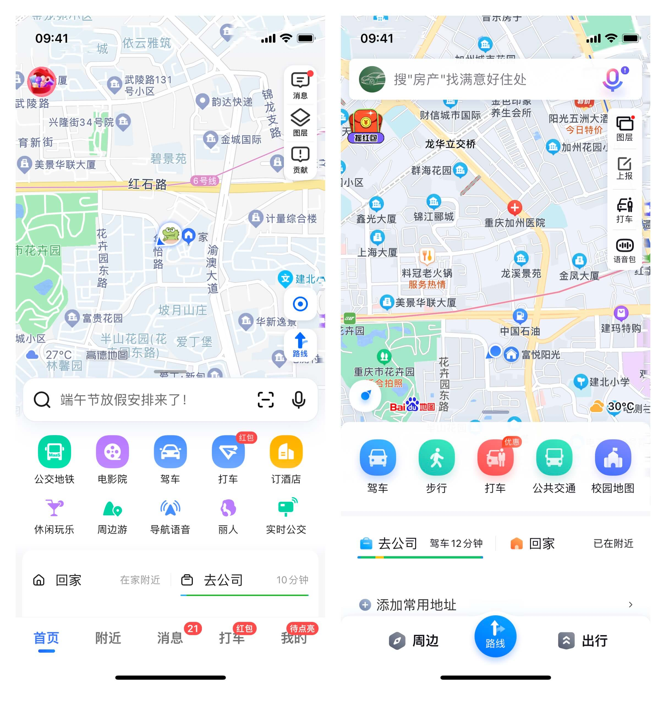
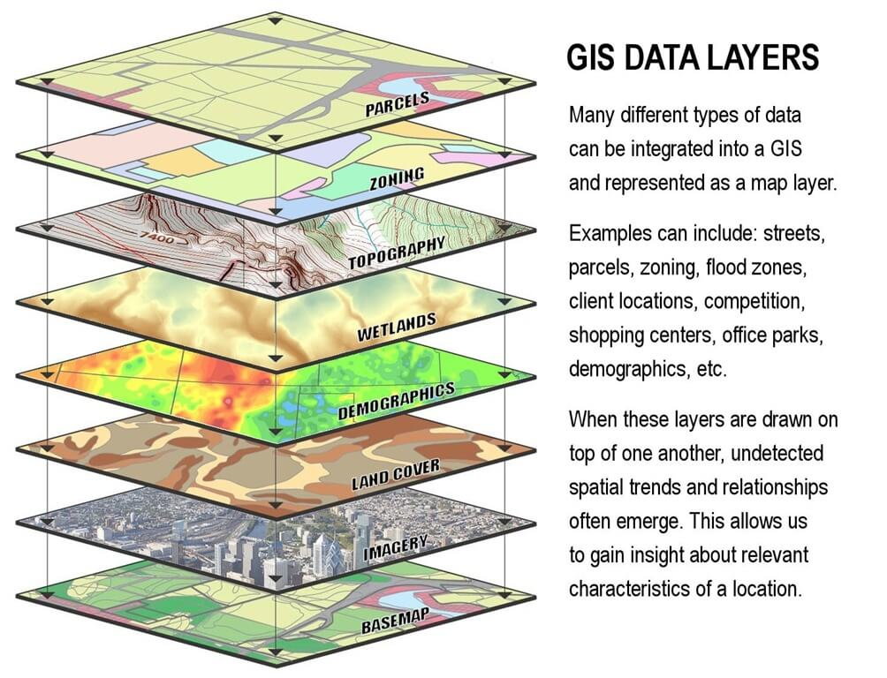

# 基本概念

## 3S

早期“3S”是指遥感 (Remote Sensing)、全球定位系统 GPS (Global Position System) 和地理信息系统 (Geographic Information System) 的简称，广义的说法则是遥感 (Remote Sensing)、地理信息系统 (Geographic Information System) 和全球导航卫星系统 (Global Navigation Satellite System)，其中 GNSS 泛指所有卫星定位系统，包括 GPS。

“3S”是空间技术、传感器技术、卫星定位与导航技术和计算机技术、通信技术相结合，多学科高度集成的对空间信息进行采集、处理、管理、分析、表达、传播和应用的现代信息技术的总称。

### RS

遥感 (Remote Sensing, RS) 即“遥远的感知”，是远距离不接触“物体”而获得其信息。通过遥感器“遥远”地采集目标对象地数据，并通过对数据的分析来获取有关地物目标的信息的一门科学和技术。

### GIS

**GIS** 是一门采集、存储、管理、分析、显示与应用地理信息的综合性技术，它的概念和基础来源于地理学和测绘学，其技术支撑是计算机技术[^1]。

地理信息系统 (Geographic Information System, GIS) 是创建、管理、分析和绘制 **所有类型数据** 的空间信息系统[^2]。其基本功能包括以下 6 个方面：

- 数据采集
- 数据编辑与处理
- 数据存储、组织与管理
- 空间查询与空间分析
- 数据输出与可视化
- 应用模型与系统开发

经过几十年的发展，GIS 技术从它的雏形——地籍数据库与土地信息系统到逐渐形成了比较成熟的空间信息系统。从地理信息系统 (GI {==System==}) 扩展到了地理信息科学 (GI {==Science==}) 以及目前的地理信息服务 (GI {==Service==}) 。

**WebGIS** 是一种用于实现现代 GIS 的模式或架构方法。它由 Web 服务提供支持。WebGIS 对权威 GIS 数据的更广泛访问提供了更多的机会，它使 GIS 更易于访问、更实惠且更普遍，它放大了 GIS 的价值以及 GIS 专业人员的作用[^3]。它将 GIS 向前推送到实时模式，而不是静态数据。最重要的是，WebGIS 将我们从专有数据转变为开放数据和共享服务，从而为每个人提供支持[^3]。

{ align=right width=360 }

以互联网为环境，以 Web 页面为用户界面，可以浏览空间数据，进行相关信息的查询，制作专题图，以及进行各种空间检索和空间分析，从而使 GIS 进入千家万户[^1]。

- 🌏 浏览地图
- 📤 导航定位
- 🚘 打车
- 🚌 实时公交
- 🔍 周边搜索（吃喝玩乐）
- ⛅ 天气
- ⚡ 充电桩
- 💪 更多……

## 图层

一个地理信息系统可以集成不同类型的数据，表示为图层。比如街区、河流、购物中心等等。

{ width=420 }

[^1]: 汤国安，地理信息系统教程（第二版），高等教育出版社。
[^2]: [什么是 GIS? - 地理信息系统制图技术](https://www.esri.com/zh-cn/what-is-gis/overview)
[^3]: [What is WebGIS?](https://www.esri.com/about/newsroom/insider/web-gis-simply)
