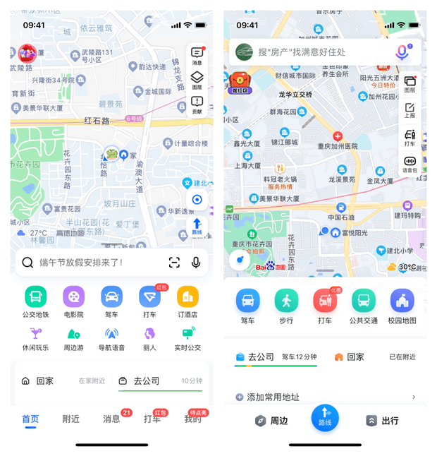

# 基本概念

## GIS

GIS 是一门采集、存储、管理、分析、显示与应用地理信息的综合性技术，它的概念和基础来源于地理学和测绘学，其技术支撑是计算机技术[^1]。

地理信息系统 (Geographic Information System, GIS) 是创建、管理、分析和绘制 **所有类型数据** 的空间信息系统[^2]。其基本功能包括以下 6 个方面：

- 数据采集
- 数据编辑与处理
- 数据存储、组织与管理
- 空间查询与空间分析
- 数据输出与可视化
- 应用模型与系统开发

经过几十年的发展，GIS 技术从它的雏形——地籍数据库与土地信息系统到逐渐形成了比较成熟的空间信息系统。从地理信息系统 (GI {==System==}) 扩展到了地理信息科学 (GI {==Science==}) 以及目前的地理信息服务 (GI {==Service==}) 。

## WebGIS

WebGIS 是一种用于实现现代 GIS 的模式或架构方法。它由 Web 服务提供支持。WebGIS 对权威 GIS 数据的更广泛访问提供了更多的机会，它使 GIS 更易于访问、更实惠且更普遍，它放大了 GIS 的价值以及 GIS 专业人员的作用[^3]。

从客户端/服务器 (C/S) 体系结构到 Web 服务的转变使我们连接到一个信息世界，从我们的企业到物联网 (IoT)、大数据等等。它将 GIS 向前推送到实时模式，而不是静态数据。最重要的是，WebGIS 将我们从专有数据转变为开放数据和共享服务，从而为每个人提供支持[^3]。

{ align=left width=350 }

以互联网为环境，以 Web 页面为用户界面，可以浏览空间数据，进行相关信息的查询，制作专题图，以及进行各种空间检索和空间分析，从而使 GIS 进入千家万户[^1]。

- 🌏 浏览地图
- 📤 导航定位
- 🚘 打车
- 🚌 实时公交
- 🔍 周边搜索（吃喝玩乐）
- ⛅ 天气
- 💪 ……

## RS

遥感 (Remote Sensing, RS) 即“遥远的感知”，是远距离不接触“物体”而获得其信息。通过遥感器“遥远”地采集目标对象地数据，并通过对数据的分析来获取有关地物目标的信息的一门科学和技术。遥感的特点如下：

1. 宏观性：遥感观测不受地形限制，并且遥感平台越高，可以同步观测的地面范围就越大，容易发现空间分布的宏观规律。
2. 时效性：遥感探测可以在短时间内对同一地区进行重复探测，发现地物的动态变化。
3. 综合性：遥感探测获得的地物电磁波特性综合反应了地球上许多自然和人文信息。
4. 经济型：与传统方法相比，遥感具有很高的经济效益和社会效益。
5. 局限性：目前遥感技术所利用的电磁波还很有限，许多波谱的资源有待开发。许多地物的某些特征还不能准确反应，需要发展高空间分辨率、高光谱分辨率遥感等。

[^1]: 汤国安，地理信息系统教程（第二版），高等教育出版社。
[^2]: [什么是 GIS? - 地理信息系统制图技术](https://www.esri.com/zh-cn/what-is-gis/overview)
[^3]: [What is WebGIS?](https://www.esri.com/about/newsroom/insider/web-gis-simply)
