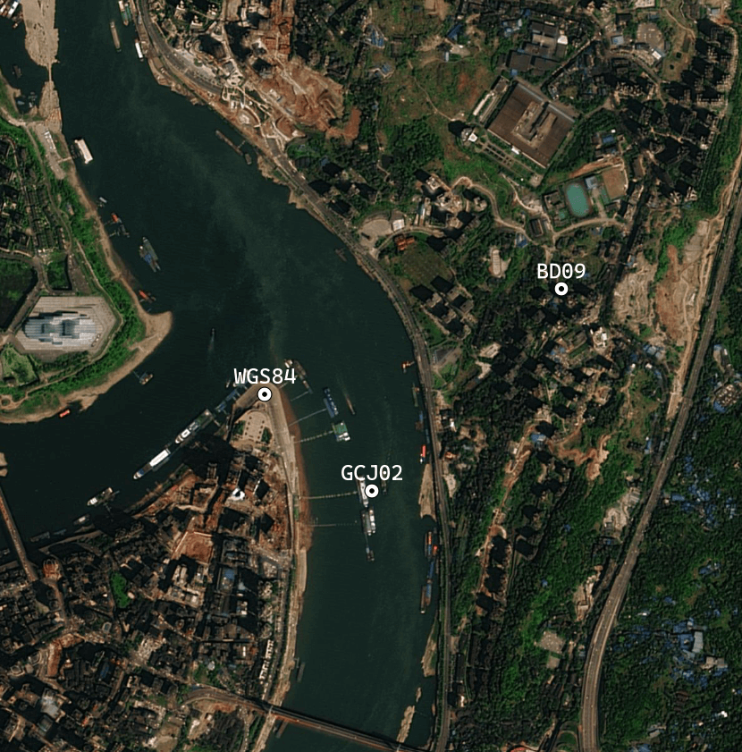

# 空间参考

## 地图投影

地图投影是按照一定的数学法则，将地球椭球面上的经纬网转换到平面上，建立地面点的地理坐标与平面直角坐标之间一一对应的函数关系。由于地球是一个不规则的曲面，地图投影不可避免地会产生变形，通常分为长度、面积和角度三种变形。因此地图投影可按变形性质分为等距投影、等积投影和等角投影。[^1]

[^1]: 张康聪（Kang-tsung Chang）（作者），陈健飞等（译者），地理信息系统导论（第 9 版），科学出版社，2018 年。

<figure markdown>
  
  <figcaption>地图投影列表(https://en.wikipedia.org/wiki/List_of_map_projections)</figcaption>
</figure>

^^投影^^ 是将数据从地理坐标转成投影坐标，^^重投影^^ 是从一种投影坐标转成另一种投影坐标。

### 即时 (on-the-fly) 投影（动态投影）

即时投影可根据不同坐标系统显示其数据集。默认情况下，将向地图或场景分配向其添加的第一个要素图层的坐标系。具有不同坐标系的后续要素图层将实时投影到地图的空间参考（动态），而不会改变源数据。[^2]

[^2]: [动态投影简介 - ArcGIS Pro | 文档](https://pro.arcgis.com/zh-cn/pro-app/latest/help/editing/introduction-to-projection-on-the-fly.htm)

## 坐标系

### 地理坐标系统

地理坐标系统 (Geographic Coordinate System，GCS) 是地球表面空间实体的定位参照系统，以经纬度表示。

### 投影坐标系统

投影坐标系统 (Projected Coordinate System，PCS) 是基于地图投影的平面坐标系统，以平面直角坐标表示空间实体。

### 火星坐标系

火星坐标系，也叫国测局坐标系 (GCJ02) ，是由中国国家测绘局制订的地理信息系统的坐标系统。国内出版的各种地图系统（包括电子形式），必须至少采用“GCJ02”对地理位置进行首次加密。

{ align=left width=222 }

| 坐标拾取器   | 地址                                       |
| ------------ | ------------------------------------------ |
| 本站 (WGS84) | https://www.naivemap.com/location-picker/  |
| 高德 (GCJ02) | https://lbs.amap.com/tools/picker/         |
| 百度 (BD09)  | https://api.map.baidu.com/lbsapi/getpoint/ |
| 腾讯 (GCJ02) | https://lbs.qq.com/getPoint/               |
