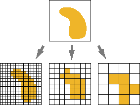
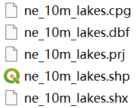

# 地理数据

地理数据是对现实世界的地理空间实体、现象以及它们之间相互关系的认知和理解的抽象表达，用于在计算机中进行处理和分析。这些数据表达方式主要分为两大类：矢量数据和栅格数据

**矢量数据**：矢量数据通过记录实体的 **坐标** 及其关系，尽可能精确的表示点、线、面等地理实体。

**栅格数据**：栅格数据以规则网格表示空间对象，每个网格单元的数值表示空间对象的 **属性** 特征，即栅格中每个单元的行列号确定位置，属性值表示空间对象的类型、等级等特征。栅格数据结构适用于表达连续分布的空间对象。

<figure markdown>
  
  <figcaption>矢量数据和栅格数据</figcaption>
</figure>

## 矢量数据

### GeoJSON

GeoJSON[^1] 是基于 JSON 格式扩展的地理数据格式，用于对矢量数据结构进行编码。GeoJSON 支持 `Point`，`LineString`，`Polygon`，`MultiPoint`，`MultiLineString`，和 `MultiPolygon` 几何类型，带有属性 (`properties`) 的几何对象称为要素 (`Feature`)，要素集 (`FeatureCollection`) 包含一系列要素 (`Feature`)。如：

```json
{
  "type": "FeatureCollection",
  "features": [
    {
      "type": "Feature",
      "geometry": {
        "type": "Point",
        "coordinates": [125.6, 10.1]
      },
      "properties": {
        "name": "Dinagat Islands"
      }
    }
  ]
}
```

### Shapefile

Shapefile[^2] 是一种用于存储地理要素的几何位置和属性信息的非拓扑简单格式。Shapefile 由多个特定文件扩展名的文件共同构成，其中 .shp .shx 和 .dbf 是必需的。

- .shp - 用于存储要素几何的主文件；必需文件。
- .shx - 用于存储要素几何索引的索引文件；必需文件。
- .dbf - 用于存储要素属性信息的 dBASE 表；必需文件。
  几何与属性是一对一关系，这种关系基于记录编号。dBASE 文件中的属性记录必须与主文件中的记录采用相同的顺序。
- .prj - 用于存储坐标系信息的文件。
- .cpg - 可选文件，指定用于标识要使用的字符集。

<!-- { width=120 } -->

### WKT & WKB

WKT(well-known text)[^3] 是一种用于表示矢量几何对象的文本标记语言，它的二进制表示方式即 WKB(well-known binary)。

```
-- WKT
POINT(1 1)
LINESTRING (2 2, 9 9)

-- WKB
0101000000000000000000F03F000000000000F03
0102000000020000000000000000000040000000000000004000000000000022400000000000002240
```

## 栅格数据

### JPEG

基于 JPEG 的栅格数据格式。

### GeoTIFF

GeoTIFF[^4] 是基于 TIFF 的扩展格式，增加了描述和使用地理图像数据所需的元数据。云优化 GeoTIFF (COG)[^5] 是一个常规的 GeoTIFF 文件，旨在托管文件服务器上，其内部组织可以在云上实现更高效的工作流。

[^1]: GeoJSON：[https://geojson.org/](https://geojson.org/)
[^2]: Shapefile：[什么是 shapefile？](https://desktop.arcgis.com/zh-cn/arcmap/latest/manage-data/shapefiles/what-is-a-shapefile.htm)
[^3]: WKT：[Well-known text representation of geometry](https://en.wikipedia.org/wiki/Well-known_text_representation_of_geometry)
[^4]: GeoTIFF：https://www.ogc.org/standard/geotiff/
[^5]: Cloud Optimized GeoTIFF (COG)：https://www.cogeo.org/
