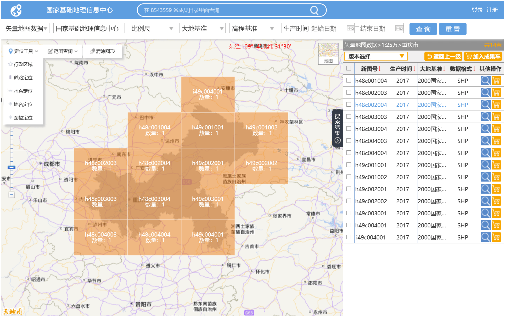
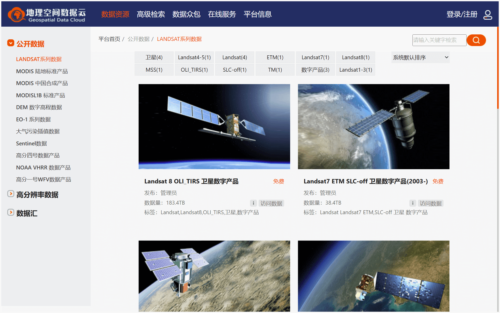
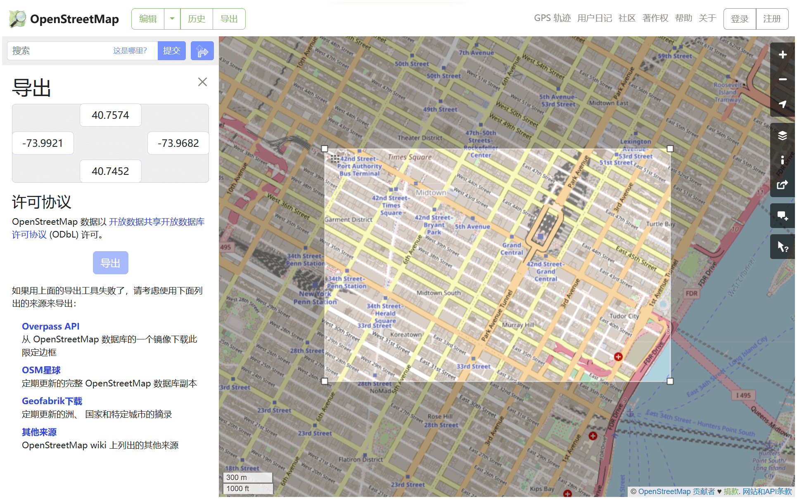
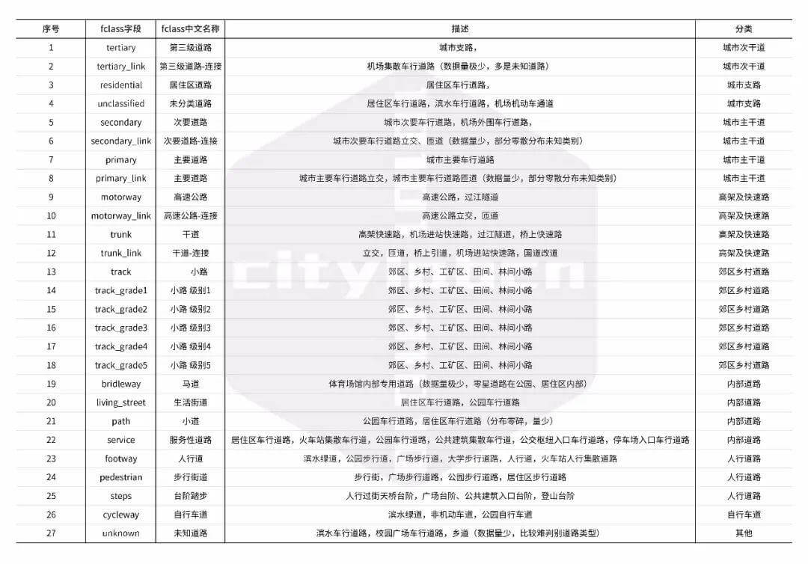

# 开放数据

## [全国地理信息资源目录服务系统](https://www.webmap.cn/)

自然资源部官方数据下载渠道，可下载 [30 米全球地表覆盖数据](https://www.webmap.cn/commres.do?method=globeIndex)、[1:100 万全国基础地理数据库](https://www.webmap.cn/commres.do?method=result100W)、[1:250 万全国基础地理数据库](https://www.webmap.cn/commres.do?method=result25W)等数据。

!!! note "注意"
    下载前请认真阅读[全国地理信息资源目录服务系统服务条款](https://www.webmap.cn/main.do?method=otherService&clickFlag=service)

## [地理空间数据云](https://www.gscloud.cn/)

提供遥感数据一站式服务，可免费下载 LANDSAT、SENTINEL、MODIS、DEM、NOAA、LUCC 等数据。

## [OSM](https://www.openstreetmap.org/)

### 下载方法

#### 框选下载

在官网框架需要下载的范围，然后点击”导出“即可下载。注意：只能下载小范围的数据。

#### Geofabrik

[Geofabrik](https://download.geofabrik.de/) 定期更新洲、国家和特定城市的数据。可下载 `.osm.pbf`、`.shp.zip`和 `.osm.bz2`三种格式数据。

### 数据分类

#### 道路

城市数据学社制作了一个 OSM 道路分类表格，具体描述及分类见下图。把大类分为高架及快速路、城市主干道、城市次干道、城市支路、内部道路、人行道路、自行车道、郊区乡村道路。[^1]

[^1]: [OSM 地图道路如何分类](http://udu.org.cn/post/8.html)
