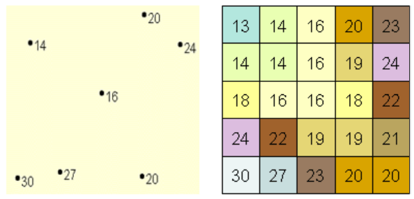

# 空间插值

插值可以根据有限的样本数据点预测栅格中的像元值。 它可以预测任何地理点数据（如高程、降雨、化学物质浓度和噪声等级）的未知值。[^1]

[^1]: [了解插值分析 - ArcGIS Pro | 文档](https://pro.arcgis.com/zh-cn/pro-app/latest/tool-reference/spatial-analyst/understanding-interpolation-analysis.htm)

如下图所示，左图是已知降雨量值的点数据集，右图是通过这些点插值后的降雨量栅格。未知值是通过使用附近已知点的值和特定的数学模型来预测的。

<figure markdown>
  { width="300" }
  <figcaption>插值为降雨面</figcaption>
</figure>

插值方法有两个主要类别：确定性方法和地统计方法。确定性插值方法可根据相似程度（反距离权重法）或平滑程度（径向基函数 (RBF) 插值法）使用测量点创建表面。地统计插值方法（克里金法）利用测量点的统计属性。地统计方法会对测量点之间的空间自相关进行量化，并会考虑到预测位置周围的采样点的空间配置。

确定性插值方法可以划分为两类：全局方法和局部方法。全局方法使用整个数据集计算预测值。局部方法由邻域内的测量点计算预测值，其中邻域是指位于较大研究区域内的较小空间区域。[^2]

[^2]: [空间插值的确定性方法](https://pro.arcgis.com/zh-cn/pro-app/latest/help/analysis/geostatistical-analyst/deterministic-methods-for-spatial-interpolation.htm)
