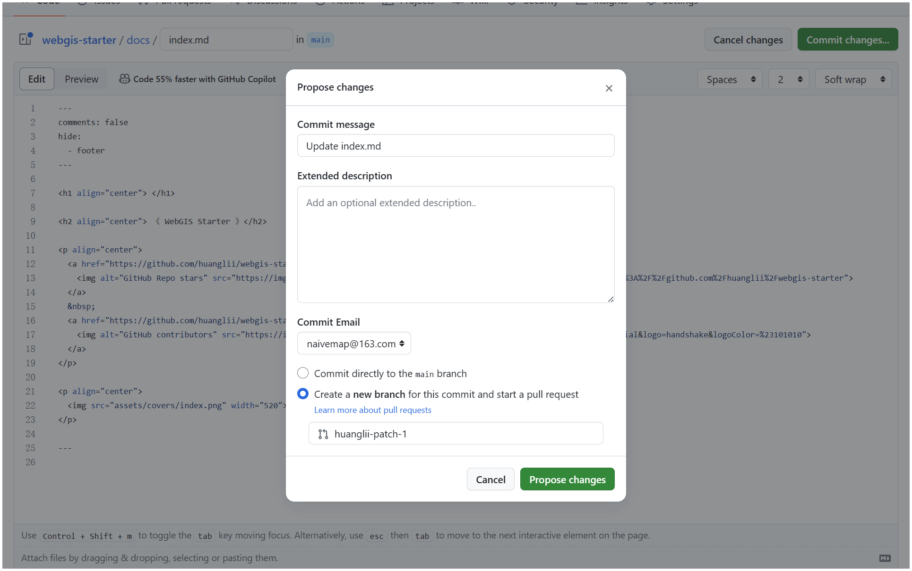

<h1 align="center"> </h1>

<p align="center">
  
</p>

<h2 align="center">《 WebGIS Starter 》</h2>

<p align="center">比较全面的 WebGIS 开源书</p>

<p align="center">
  <a href="https://github.com/huanglii/webgis-starter">
    
  </a>
  &nbsp;
  <a href="https://github.com/huanglii/webgis-starter">
    
  </a>
</p>

---

## 关于作者

[huangli](https://github.com/huanglii)

---

## 一起创作

由于作者能力有限，书中难免存在一些遗漏和错误，请您谅解。如果您发现了笔误、失效链接、内容缺失、文字歧义、解释不清晰或行文结构不合理等问题，请协助我们进行修正，以给读者提供更优质的学习资源。

### 内容微调

每个页面的右上角都有“编辑此页”图标。您可以按照以下步骤修改文本或代码。

1. 点击“编辑此页”图标，如果遇到“需要 Fork 此仓库”的提示，请同意该操作。
2. 修改 Markdown 源文件内容，检查内容的正确性，并尽量保持排版格式的统一。
3. 点击右上角“Commit changes”按钮，填写修改说明，选择“Create a new branch...”，然后点击“Propose file change”按钮。页面跳转后，点击“Create pull request”按钮即可发起拉取请求。



### 内容创作

如果您有兴趣参与此开源项目，那么需要实施以下 Pull Request 工作流程。

1. 登录 GitHub ，将本仓库 Fork 到个人账号下。
2. 进入您的 Fork 仓库网页，使用 git clone 命令将仓库克隆至本地。
3. 在本地进行内容创作，本地运行参考 [本地运行](#_5)。
4. 将本地所做更改 Commit ，然后 Push 至远程仓库。
5. 刷新仓库网页，点击“Create pull request”按钮即可发起拉取请求。

### 本地运行

本项目需要 Python 3.x 环境，建议使用 [Miniconda](https://docs.conda.io/projects/miniconda/en/latest/#)。

```sh
# 安装 mkdocs-material
pip install mkdocs-material

# 启动服务
mkdocs serve
```

然后在浏览器访问 http://127.0.0.1:8000 即可。
